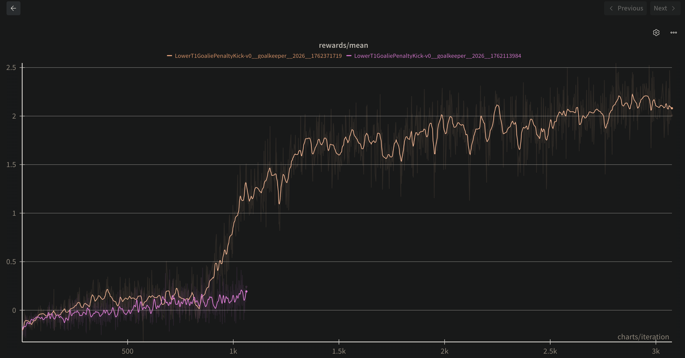
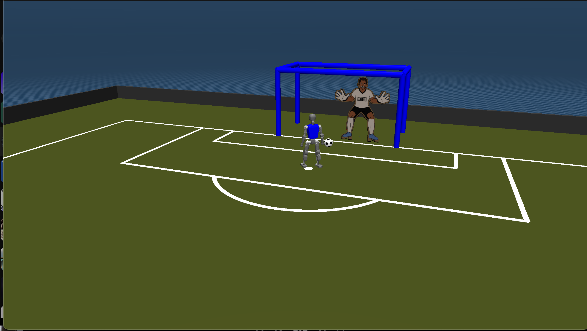

# Hierarchical Reinforcement Learning for Beginners

## How to make RL easier to train

The environment is a simple robotic environment where the goal is to score a goal via a penalty kick against a moving goalie. More details in [Environment.md](./Environment.md).

### First Attempt

I dove straight into training it with Soft Actor-Critic without any prior knowledge about robotics. Unsurprisingly, the training failed terribly. That's what you should not do.

### Second Attempt

Then, I went back to using PPO, my old friend in RL. I also plan to use a discrete action space to make it even easier. Even with that, I don't think it's enough to solve the environment."

The official competition provided a pretrained model for low-level control for walking. The low-level control is used for translating high-level commands into low-level joint actions. It's only for walking, but when I played with it, I realized the robot could score goals just by touching the ball with its leg. It's not a 'kick,' but hey, it works.
Then, I had the idea to train a hierarchical RL setup..

"The high-level actions are x_vel, y_vel, and yaw. So, I set up the high-level model training using RL. I discretized the action space into 11 actions for each dimension, which gives a total of 11^3 = 1331 discrete actions. But it isn't working well.

### Third Attempt

So, I reduced the action space to just 7 specific commands. 1.5

FACT => Making action space smaller should make RL training easier.

```bash
commands = [
    [0, 0, 0], # no-op
    [1.5, 0, 0], # forward
    [-1.5, 0, 0], # backward
    [0, 1.5, 0], # move left
    [0, -1.5, 0], # move right
    [0, 0, 1.5], # rotate left
    [0, 0, -1.5], # rotate right
]
```

### Fourth Attempt

After visualizing the checkpoints, I realized that high-level commands were being issued at every timestep. This isn't necessary because the low-level model needs time to execute the high-level action (like moving forward). I confirmed that the optimal duration for a high-level action is 50 steps by playing with the teleoperator.

This is temporal abstraction. The max timesteps is 5000, so with a high-level action every 50 steps, there are only 100 high-level actions per episode. It's easier for credit assignment.

Training is a lot better now. It's scoring 30% of the time. I need to improve it more.

### Fifth Attempt

I decided to study the underlying robotics concepts first. I now understand quaternions and have implemented a transformation to convert observations into the robot's local reference frame. This makes the state space translation-invariant. Finally, the training is working.
It is because this reduces the state space complexity, making it easier for the model to learn effective policies and value functions.

### Reward curve



Pink line: Fourth attempt (without robot frame transformation)
Orange line: Fifth attempt (with robot frame transformation)

### Evaluation

The best checkpoint scores around 80% of the time during evaluation over 100 episodes. I included the best model checkpoint in the `ppo/` directory.



### Teleoperator

```python
python ./booster_control/teleoperate.py --env LowerT1GoaliePenaltyKick-v0 --pos_sensitivity 1.5 --rot_sensitivity 1.5
```

### PPO Training

```python
python -m ppo.train --seed 2026 --env_id LowerT1GoaliePenaltyKick-v0 --wandb_project_name ppo_goalie_penalty_kick_skipper --wandb_entity l16h7 --num_envs 100 --total_timesteps 100_000_000 --num_minibatches 20 --update_epochs 1 --learning_rate 3e-4 --eval_interval 8 --checkpoint-interval 40 --num_steps 50 --track
```

### PPO Visualization

```python
python -m ppo.visualize --checkpoint ./ppo/
```

### Credits

Booster Soccer Showdown by ArenaX Labs
https://github.com/ArenaX-Labs/booster_soccer_showdown

CleanRL PPO
https://github.com/vwxyzjn/cleanrl
